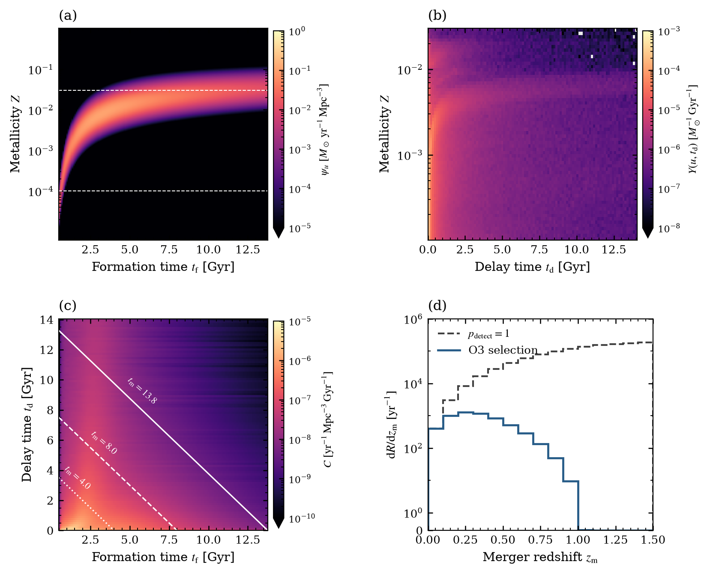
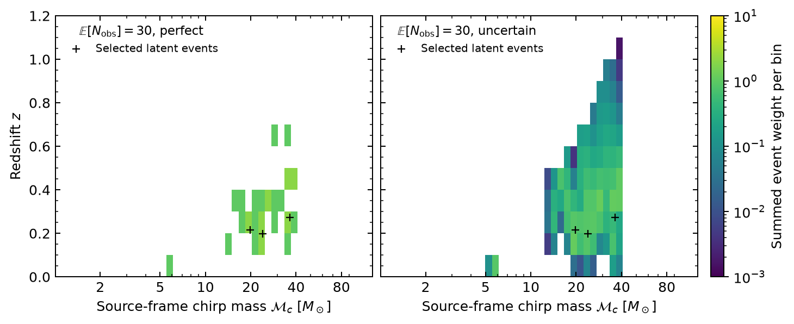
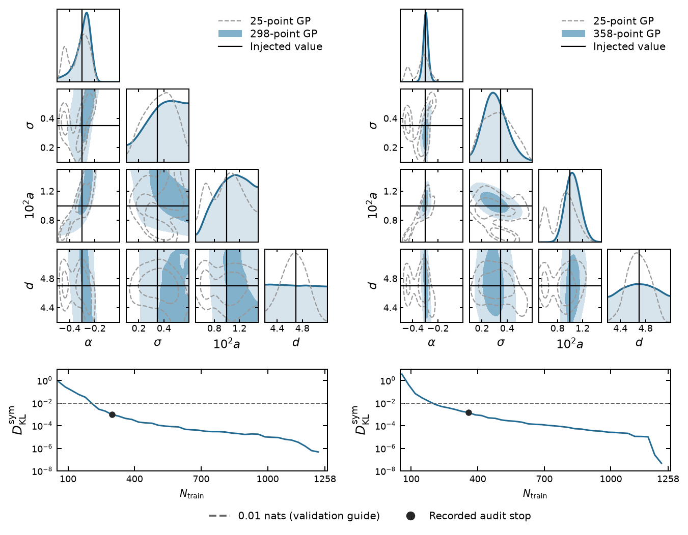
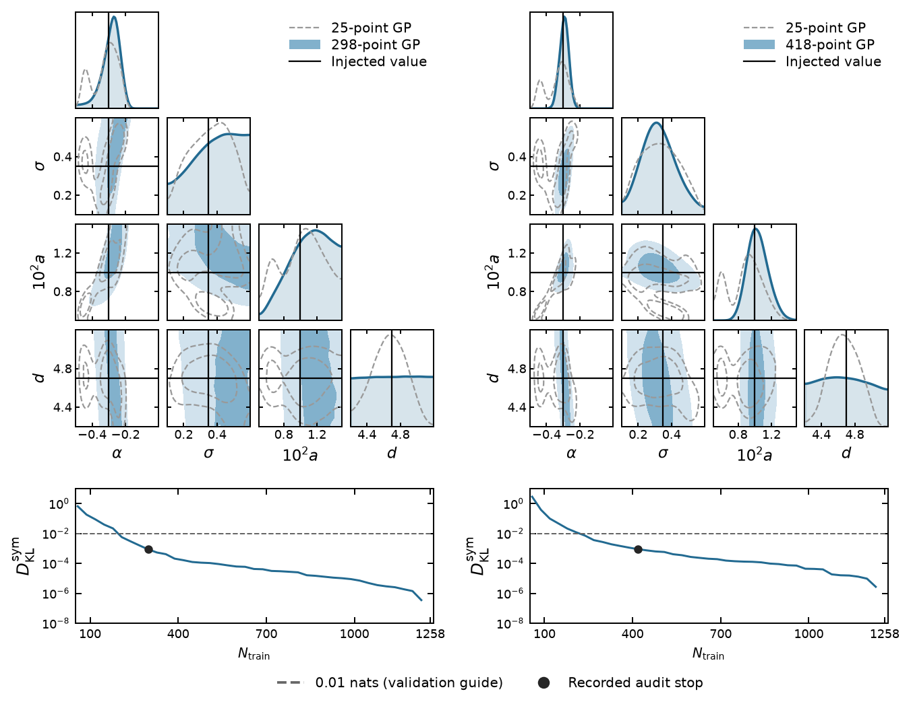
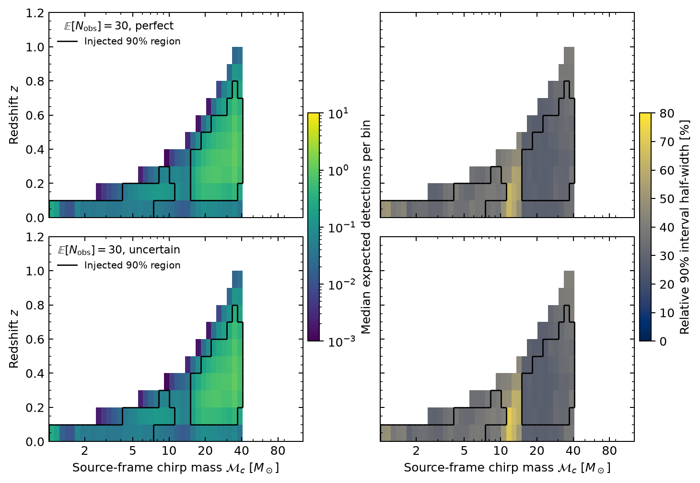
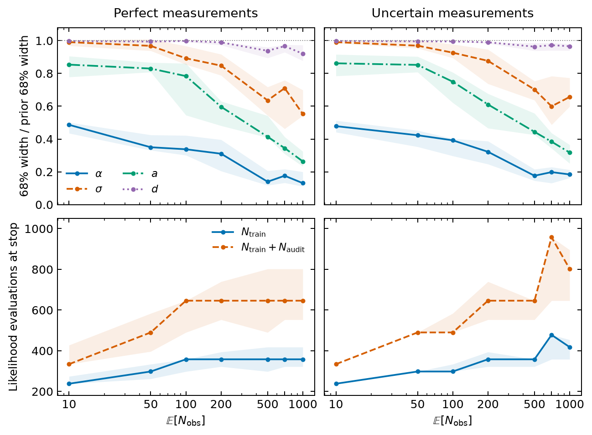
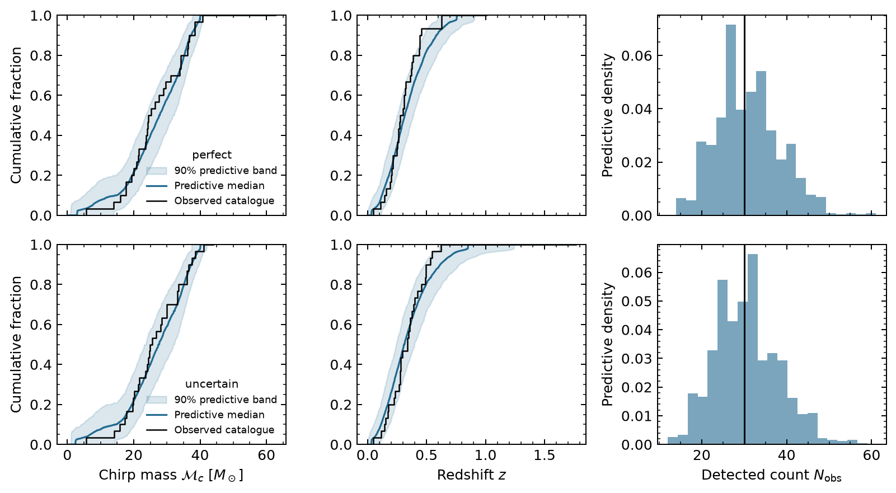
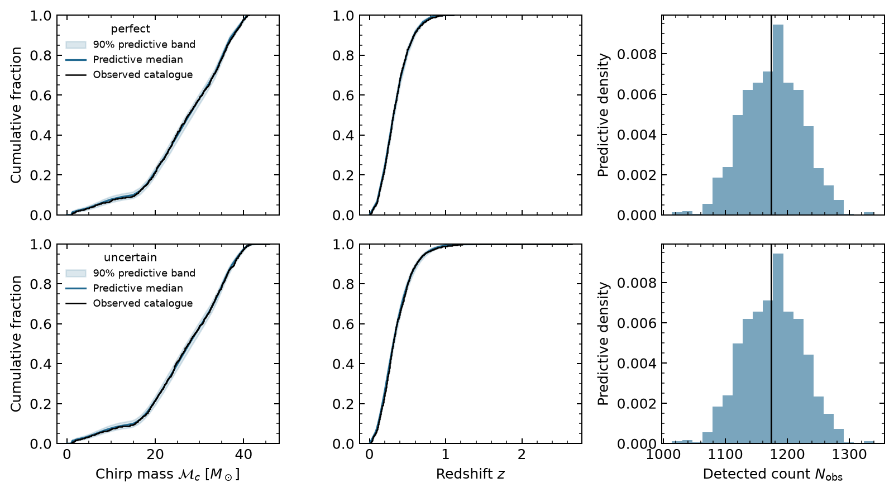
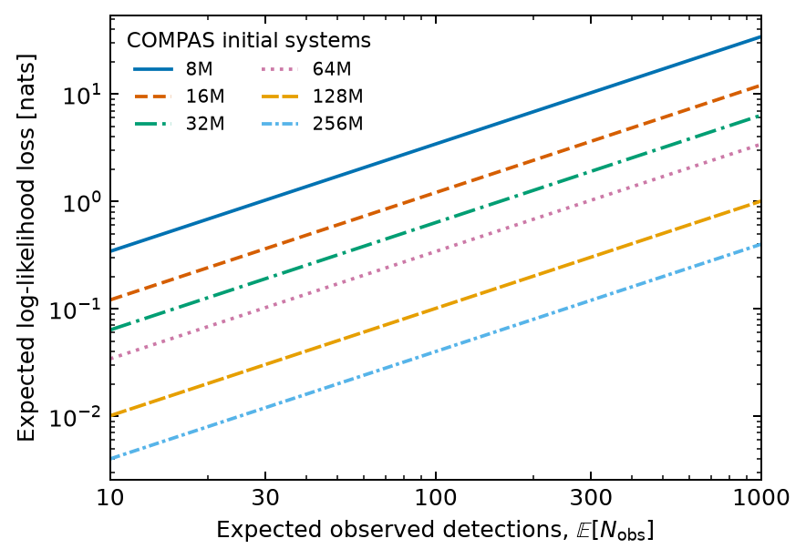
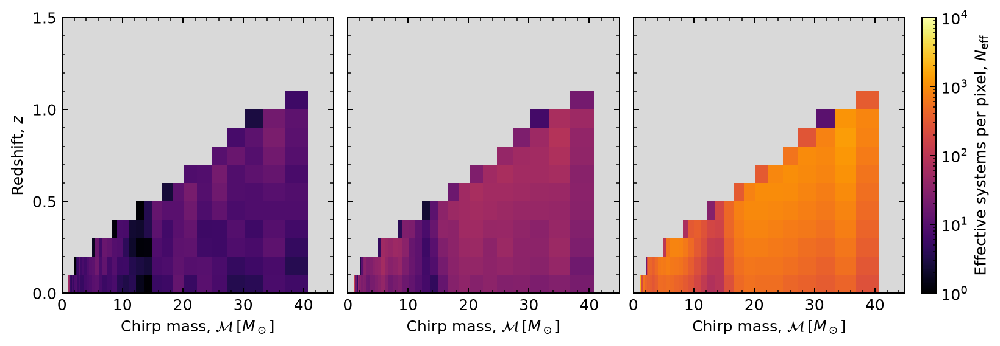

# Four-input GP: status and paper discussion (16 September 2026)

## Start here

- **Main goal:** infer all four parameters with the GP: metallicity evolution `alpha`, metallicity spread `sigma`, SFR amplitude `a`, and SFR evolution `d`.
- **Current campaign:** 632 four-input fits on OzSTAR, using the existing paper catalogues and fixed 256M COMPAS population. These are inference jobs, not new stellar-evolution simulations.
- **Live check on 16 September:** 15 fits scored: **9 accurate, 6 inaccurate, 0 numerically unresolved**; four running, 612 pending, one timed-out fit still incomplete. These submission-ordered results are not a representative success-rate estimate.
- **The draft is transitional.** Its new four-input table is a 15 September snapshot (7 scored), already older than this page. Its GP-dependent figures still show the **three-input, amplitude-marginalized baseline**. A four-parameter corner plot does not necessarily mean a four-input GP: the baseline reconstructs amplitude analytically.
- The population-size, pixel-support, event-weight and physical-rate illustrations do not depend on GP dimension and remain applicable.
- **Not yet established:** the number of random points needed, a validated four-input stopping rule, prior-wide recovery/calibration, and a four-input replacement for every paper plot.

## Runtime follow-up: measured bottleneck

- A subsequent one-CPU OzSTAR benchmark identifies **hyperparameter fitting** as the main late-run cost. At 2994 labels, 20 optimizer steps take **62.9 seconds**; extrapolating to 250 steps gives **13.1 minutes**, consistent with the observed checkpoint intervals.
- In comparison: three direct labels take **0.013 seconds**, acquisition **2.55 seconds**, and full conditioning **1.48 seconds**. A one-step control takes **3.92 seconds** versus 62.91 seconds for 20 steps; this supports optimizer computation, rather than compilation, as the dominant cost.
- An experimental incremental update reduces conditioning to **0.033 seconds**, with prediction/acquisition differences below **8e-9** on the tested 64 queries. That speeds this operation about 44 times, but saves only about 13 seconds across the nine between-refit updates: optimizing the refit itself is the priority.
- **Queue changed after the snapshot above:** Slurm would not hold the array, so pending entries **20–631 were cancelled**, with all 612 IDs saved for resubmission. The four running jobs were left intact. There are no longer 612 queued entries awaiting automatic execution.
- Reproducible evidence and limitations: `docs/studies/amplitude_gp/runtime_20260916/README.md`, `profile_results.json`, and `paused_pending.txt`. The completed warm-start comparison is summarized below; no production fitting change has been deployed.

### Warm starts: promising, not yet validated inference

- On one 2994-label, 100-event-expected perfect-measurement checkpoint, starting from the previous fitted hyperparameters gives **64 s for 20 Adam steps** or **72 s for 20 L-BFGS-B iterations**.
- Centred likelihood-error RMSE on the diagnostic queries near the queried peak changes from **0.38** for the saved 250-step model to **0.34** (warm Adam) or **0.15** (warm L-BFGS-B). The training objective also improves substantially.
- L-BFGS-B reached its iteration limit, so this is not an optimizer convergence claim. These are changed GP models, and query residuals are not the independent posterior-accuracy gate.
- Recommended next step: validate convergence-based warm refits across representative catalogues, with posterior scoring and acquisition checks, before resubmitting the paper campaign. The biggest opportunity is the refitting policy, not just the conditioning update.

## Are the long jobs a bug?

### What we checked

- The four apparently identical `16547555_1` entries are actually array tasks **16, 17, 18 and 19**. The default Slurm output truncated their IDs.
- They are processing expected-count-500 examples, with saved checkpoints between **2124 and 2394 of 2994 labels** at the first check; a later check confirmed BO advances from 2394 to 2424 and from 2124 to 2154. Status is written only every 30 labels, after refitting; silence between updates is expected.
- Checkpoint timestamps confirm strong growth in cost: the first 30 added labels took roughly **17–77 seconds**, while the last 30 in completed fits took **806–934 seconds (13–16 minutes)**. A checkpoint interval includes labeling, acquisition, conditioning and refitting; it does not isolate any one operation.
- Completed full runs took approximately **6.1–7.3 hours** each. Running-job CPU times closely track elapsed time; memory usage is about **2.2–2.6 GB**, below the 16 GB allocation. This supports active CPU work rather than a hung process or a memory-capacity problem.
- Task 0 previously hit eight hours at 2934 labels. Its checkpoint recovery, job **16563452**, completed in 30 minutes. Array concurrency is back to four.
- Task **12**, `count_n200_perfect_c200_s17_bo`, has now also timed out at **2934 labels**. Its status file still says `training`: scheduler state must be checked alongside files. This run needs recovery; it is not an accuracy failure.

### Why production is expensive

- `paper_campaign.py` fixes GP conditioning capacity at **3008**, rounded up from the 2994-label budget.
- After each three-label addition, `gpry_rules._condition` constructs a dense covariance, performs a Cholesky decomposition, and computes its inverse. Padding prevents changing-shape recompilation in this operation, but still incurs a full 3008-by-3008 matrix calculation, including early in training.
- Every 30 labels, `run_pilot.fit` starts a **250-step exact-GP hyperparameter fit**. Its training dimension grows between fits. Exact-GP fitting has roughly cubic matrix cost; changing fit shapes can also incur JAX compilation.
- Random and Sobol continuations use the same conditioning/refit schedule. Their hours-long runtimes show that BO acquisition alone is not the explanation.
- The compute-node smoke test used **174 labels and capacity 192**. It checked execution and numerical parity, **not production-scale runtime**. That pilot was insufficient for sizing this campaign.
- We have identified expensive code paths, but have not measured their separate fractions of wall time. Do not present a guessed runtime breakdown as a profile.
- At roughly seven hours per fit and four concurrent workers, 632 fits cost about **46 days of wall time** in total, before queue delays/recovery. This is an extrapolation, not an ETA; a runtime fix matters.

### Next engineering steps

- Profile label evaluation, conditioning, acquisition, hyperparameter fitting and compilation separately at production-sized checkpoints, with JAX synchronization in timing measurements.
- Test cheaper exact conditioning (e.g. block Cholesky updates or smaller staged capacities), and avoid redundant conditioning for random designs where scientifically equivalent.
- Compare predictions and selected BO points against frozen saved states before adopting an optimization. Changes to the refit/acquisition schedule are new experimental configurations, not transparent speed fixes.
- Preserve the frozen campaign code, inputs and checkpoints. Resume timeouts with the same identity; evaluate optimizations in a separate benchmark before replacing the queued workload.

## What we changed recently

- Added direct four-input likelihood training, while retaining exact analytical amplitude calculations as an independent reference.
- Exported a compact exact fixed-population rate operator; checked 32 prior points against the original rate calculation to relative/absolute tolerance `1e-12`. This speeds labels without introducing interpolation over likelihoods.
- Froze source and input hashes; checkpoints retain training labels, GP parameters and random-generator state for recovery.
- Set up a dedicated OzSTAR Python 3.12 environment and Slurm runtime checks. Each paper worker requests one CPU, 16 GB and eight hours.
- Archived obsolete scripts/studies outside the checkout, preserving results and dirty work in `../cosmic_integration_archive/legacy_studies_20260915/`. Large ignored test data were retained.
- Marked the draft's new four-input evidence as preliminary and distinguished it from the older baseline figures.

## The four science questions

### 1. Is the finite COMPAS population large enough?

- Compare direct likelihoods/rates across actual nested populations, independently of any GP.
- The paper's population-loss plot compares 8M–256M with a finite 512M reference. At 1000 expected detections, losses fall from **34.3 nats (8M)** to **0.40 nats (256M)**.
- This demonstrates catalogue-size sensitivity, not that 256M is universally adequate. The subsets are nested, not independent realizations; 512M is not infinite-population truth.
- A likelihood offset at one parameter vector does not determine posterior bias. The draft separately reports posterior comparisons; independent population realizations and broader parameter coverage remain important.

### 2. Does the GP reproduce the posterior accurately?

- Train on direct four-input log-likelihood labels; score against numerical posterior references using analytical amplitude integration/reconstruction and two independent shape designs.
- Accuracy requires KL and parameter-summary checks, not just a visually plausible corner plot. The largest directed KL must be below **0.01 nats**, mean/interval-endpoint differences below **0.2 reference standard deviations**, and 68%/95% width differences below **10%**. Numerical reference adequacy is checked separately.
- Current final-budget outcomes include six failures. Reaching 2994 points does **not** ensure accuracy.
- Next: local likelihood residuals, amplitude slices, and checkpoint histories, especially for failed fits. Preserve failures and unresolved numerical references in reporting.

### 3. Does sampling reproduce the intended target?

- Separate GP approximation error from sampler error: compare sampling against a numerical posterior for the same GP target, then compare that target against the direct likelihood.
- Check separated initializations, R-hat, ESS, divergences and missed modes. Good chains alone do not validate the GP.
- Do not draw a fresh noisy log likelihood on each NUTS call. A mean target and a deterministic uncertainty-adjusted target are distinct experiments; GP uncertainty calibration must be checked before interpreting the latter.
- The present 632-fit campaign's final scoring is numerical posterior comparison, not an end-to-end NUTS injection campaign.

### 4. Is BO helping, and how many random points are needed?

- Matched runs share the catalogue, initial design, GP model and label budget. The campaign includes **330 BO, 226 IID-random and 76 Sobol fits**.
- Initial design: 64 scrambled-Sobol points plus 80 boundary anchors; retain all labels; add three at a time, refit every 30, stop at a fixed 2994-label budget.
- Final-budget success/failure answers whether a method is accurate at that budget. It does **not** answer how many labels it needed.
- Score saved checkpoints against the same independent references. Report the first passing checkpoint confirmed at the next checkpoint; runs without confirmed accuracy remain **`>2994`**, rather than being dropped.
- Compare both direct-label counts and measured wall time. More efficient label acquisition need not mean faster computation.

## Amplitude and coarse pixels: points for Ilya

- At fixed shape, rates scale exactly with amplitude: `r(a) = (a / 0.012) r(0.012)`. Analytical labels still train a GP in all four coordinates.
- For `N` observed events and a uniform amplitude prior, the fixed-shape amplitude posterior is a **prior-truncated Gamma distribution with shape N+1**, not a Poisson distribution. Away from bounds its fractional width is `1/sqrt(N+1)`, approaching `1/sqrt(N)` for large counts.
- Test GP amplitude slices against this reference. The fully marginalized amplitude posterior can be broader because shape and amplitude correlate; that alone is not a bug.
- The current analysis fixes approximately 10% chirp-mass bins and `dz=0.1`. Coarser bins improve simulation support but erase distinctions between models; measurement uncertainty also smooths information.
- Suggested wording: **“We validate inference conditional on the adopted discretization; convergence with finer mass–redshift bins is not established here.”** Do not claim coarse graining is negligible.
- Adaptive coarse-to-fine pixels are a separate resolution test. Rebin the physical prediction and event response consistently; quantify posterior changes against a finer reference before adopting them.

## Guide to the figures currently in the draft

The images below are exact copies of the draft's existing PNG companions, not newly computed four-input results. Source paths are relative to the main `cosmic_integration` checkout. Included TeX sections determine which figures are actually in the paper; other images in the figure directory may be older or unused.

### Physical cosmic integration

- **Status:** No GP.
- **Figure:** `cosmic_integration_physical.pdf`.
- **Producer:** `docs/illustrations/cosmic_integration/plot_physical.py`.
- **Draft location:** `overleaf/sections/cosmic_integration.tex`.
- Illustrates how the fixed COMPAS population is reweighted with metallicity and SFR evolution to predict detected rates over chirp mass and redshift.
- Discuss the forward model and selection here. This is a physical illustration, not a GP accuracy or speed benchmark.

### Perfect versus uncertain event information

- **Status:** No GP.
- **Figure:** `paired_weights.pdf`.
- **Producer:** `docs/studies/paper_completion/weight_rate_figures.py`.
- **Draft location:** `overleaf/sections/bo_simulation.tex`.
- Same 30-event latent catalogue, with perfect and uncertain measurement views; inputs are in `docs/studies/event_uncertainty/paired_20260912/ensemble/`.
- Normalize each event coefficient over bins, `C_ib / sum_b C_ib`, to visualize event information and summed occupancy.
- These displayed weights are not posterior bin-membership probabilities under an inferred population.

### Posterior evolution: perfect measurements

- **Status:** Three-input baseline.
- **Figure:** `posterior_stop_perfect.pdf`.
- **Producer:** `docs/studies/paper_completion/count_history_manuscript.py`.
- **Draft location:** `overleaf/sections/bo_results.tex`.
- Catalogue 200 at 100 and 1000 expected detections contains 108 and 986 actual events. Shape posteriors come from the amplitude-marginalized GP; amplitude is reconstructed conditionally.
- Compare the 25-point visualization refit with the frozen audit-selected result. The operational training starts at 58 labels, not 25.
- Selected budgets: 298 training + 192 audit calls (100 expected), 358 + 288 (1000 expected). The lower curve compares against an independently validated late GP; this late-GP distance is not the stopping criterion.
- Inputs: `docs/studies/operational_stopping/gpry_compas/count_history_20260912/`; direct-reference checks underpin acceptance.

### Posterior evolution: uncertain measurements

- **Status:** Three-input baseline.
- **Figure:** `posterior_stop_uncertain.pdf`.
- **Producer:** `docs/studies/paper_completion/count_history_manuscript.py`.
- **Draft location:** `overleaf/sections/bo_results.tex`.
- Same latent catalogues as the perfect plot; event coefficients integrate the continuous measurement response across bins.
- Selected budgets: 298 training + 192 audit calls (100 expected), 418 + 384 (1000 expected).
- The paired construction isolates measurement effects. Broader posteriors do not automatically mean fewer training evaluations.

### Posterior detected-rate maps

- **Status:** Three-input baseline.
- **Figure:** `paired_rate_posterior.pdf`.
- **Producer:** `docs/studies/paper_completion/reference_selected_predictive.py` selects the checkpoints and calls `weight_rate_figures.py`.
- **Draft location:** `overleaf/sections/bo_results.tex`.
- Uses the 30-event paired example, with both baseline posteriors selected at 482 likelihood labels.
- Draw 20,000 posterior samples, reconstruct conditional amplitude, and compute expected bin intensity `T*r_b`; display medians and 90% intervals.
- These are latent rate uncertainties, not replicated observations. No fresh Poisson catalogue or measurement noise is added here.

### Constraints and stopping cost versus catalogue size

- **Status:** Three-input baseline.
- **Figure:** `acquisition_summary.pdf`.
- **Producer:** `docs/studies/paper_completion/count_history_manuscript.py`.
- **Draft location:** `overleaf/sections/bo_results.tex`.
- 70 histories: five latent catalogues at each of seven expected counts, with paired perfect/uncertain views. Uses saved offline histories and frozen audit stops.
- All 70 baseline stops pass the direct-reference checks; training costs span 238–478 labels and total costs including audits span 334–958.
- Across the 35 pairs, uncertain measurements stop earlier in 9, at the same budget in 18, and later in 8.
- This is not the new four-input BO-versus-random efficiency result.

### Replicated catalogues: 30 events

- **Status:** Three-input baseline.
- **Figure:** `posterior_predictive_30.pdf`.
- **Producer:** `docs/studies/paper_completion/reference_selected_predictive.py` with `docs/studies/event_uncertainty/paired_diagnostics.py`.
- **Draft location:** `overleaf/sections/bo_controls.tex`.
- Generate 1000 replicated catalogues per measurement view from the selected 482-label posterior, including Poisson counts and fresh uncertain-measurement noise.
- Compare observed mass/redshift empirical CDFs with pointwise 90% predictive bands and compare event counts.
- These pointwise bands are not simultaneous acceptance regions; a single example is not a coverage campaign.

### Replicated catalogues: 1174 events

- **Status:** Three-input baseline.
- **Figure:** `posterior_predictive_1200.pdf`.
- **Producer:** `docs/studies/paper_completion/reference_selected_predictive.py` with `docs/studies/event_uncertainty/paired_diagnostics.py`.
- **Draft location:** `overleaf/sections/bo_controls.tex`.
- 1200 expected detections, 1174 realized events; paired perfect/uncertain views. Both baseline posteriors are selected at 610 labels.
- Same 1000-replica construction as the small example. Count agreement is conditional on amplitude inferred from that same observed count.
- Marginal CDF agreement does not test every feature of the joint mass–redshift distribution.

### Finite-population likelihood discrepancy

- **Status:** Direct calculation; no GP.
- **Figure:** `population_likelihood_loss.pdf`.
- **Producer:** `docs/studies/paper_completion/population_likelihood_loss.py; plot_likelihood_loss.py`.
- **Draft location:** `overleaf/sections/bo_controls.tex`.
- Compare nested 8M, 16M, 32M, 64M, 128M and 256M populations against 512M at fixed fiducial parameters and nominal uncertain measurements.
- Compute `Nbar * E_512[u - 1 - log(u)]`, where `u` is the ratio of measurement-rate intensities. This includes both Poisson rate and distribution shape.
- Two independent integrations of 262,144 simulated event measurements each give 524,288 total. Counts 10–1000 use exact exposure scaling, not separate simulated catalogues.
- At 1000 expected events: 34.3, 12.1, 6.36, 3.42, 1.01 and 0.40 nats. Numerical standard errors are below 0.8%; finite-reference and population-realization uncertainty are separate.

### Effective COMPAS support per pixel

- **Status:** Direct calculation; no GP.
- **Figure:** `population_pixel_support.pdf`.
- **Producer:** `docs/studies/population_precision/manuscript_figures.py`.
- **Draft location:** `overleaf/sections/bo_controls.tex`.
- Compare 8M, 32M and 512M on identical mass–redshift bins; compute effective weighted systems `(sum w)^2 / sum(w^2)`.
- Grey means zero predicted rate; the same logarithmic colour scale is used throughout. Full mass support is retained in the likelihood.
- Unequal weights reduce effective support, and one binary contributes to several redshift cells. Pixels are not independent simulation realizations; this is not a posterior-accuracy gate.

## Current final-budget results

All rows are catalogue 200, at 2994 labels. Perfect and uncertain views share their latent catalogue. These early rows do not measure a general success rate or the first accurate training budget.

| Expected events | Measurements | BO | IID random |
|---|---|---|---|
| 10 | Perfect | Pass | Pass |
| 10 | Uncertain | Pass | Pass |
| 50 | Perfect | Pass | Fail |
| 50 | Uncertain | Pass | Fail |
| 100 | Perfect | Pass | Fail |
| 100 | Uncertain | Pass | Fail |
| 200 | Perfect | Timed out at 2934 | Fail |
| 200 | Uncertain | Pass | Fail |

## Campaign and evidence locations

- **Runner:** `docs/studies/amplitude_gp/paper_campaign.py`.
- **Frozen input manifest:** `docs/studies/amplitude_gp/paper_inputs_20260915/manifest.json`.
- **Runtime evidence retrieved for this page:** `docs/studies/amplitude_gp/paper_campaign_20260915/runtime_snapshot_20260916.json` (scores and checkpoint timestamps; collected over several minutes, so not an atomic snapshot). Figure-copy hashes are in [provenance.json](../.gitbook/assets/gp4-status-20260916/provenance.json).
- **Campaign records:** `docs/studies/amplitude_gp/paper_campaign_20260915/` (source/input provenance, earlier retrievals and summaries).
- **OzSTAR root:** `/fred/oz303/avajpeyi/studies/compas_gp4_paper_20260915/`.
- **Authoritative combination:** Slurm state + `runs/<name>/checkpoint_*.npz` + `complete.json` + `score.json`. A stale `status.json` alone cannot establish whether a job is running.
- **Draft:** `overleaf/ms.tex`; compiled 15 September snapshot: `overleaf/output/four_input_progress_20260915/ms.pdf`.
- **New draft table:** `overleaf/sections/four_input_progress.tex` and `four_input_table.tex`; describes earlier results and must be refreshed before circulation as current.

## Suggested colleague discussion order

1. Agree that the main analysis should use the direct four-input GP, with analytical amplitude retained as a validation tool.
2. Walk through event weights → posterior constraints → inferred rates → replicated observations; distinguish the quantities each figure tests.
3. Review the direct population-size evidence and explicitly reserve the finer-grid convergence claim.
4. Review new four-input failures as well as successes; choose diagnostic gates before calling replacements validated.
5. Prioritize production-scale profiling and checkpoint scoring. Decide on a measured runtime configuration before spending weeks on the remaining campaign.
